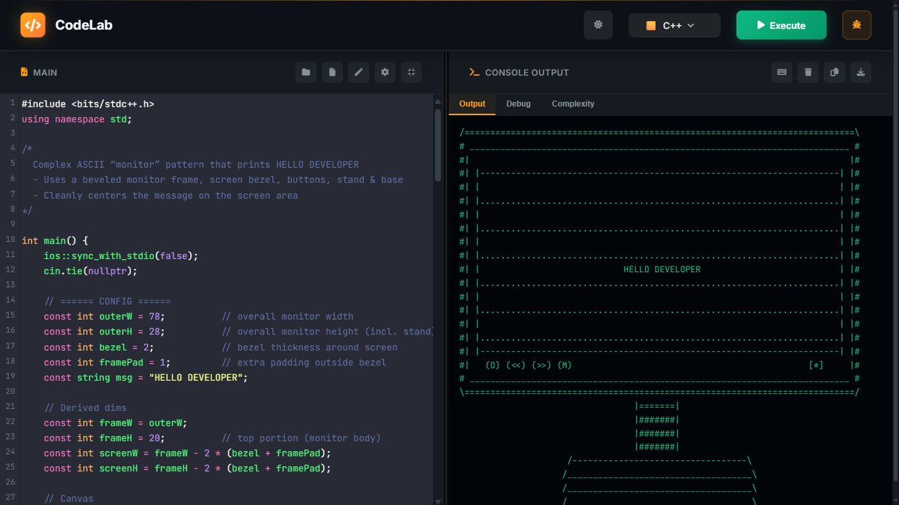
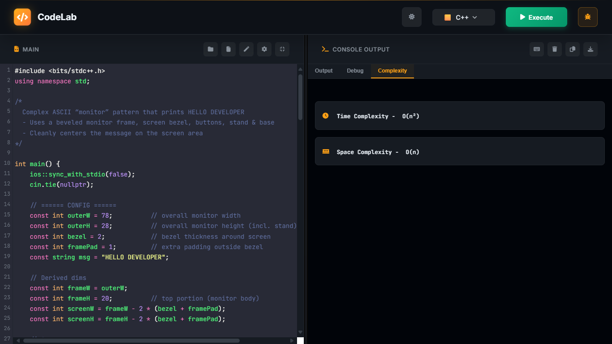

# CodeLab - A Premium Multi-Language Online Code Editor

CodeLab is a feature-rich, browser-based code editor with a powerful Node.js backend. It supports code execution in multiple languages, provides real-time complexity analysis, and offers a sleek, responsive interface for an exceptional coding experience.

## ✨ Features

-   **Multi-Language Support**: Execute code in JavaScript, Python, Java, C++, and more.
-   **Complexity Analysis**: Get instant feedback on the time and space complexity of your algorithms.
-   **Modern UI**: A clean, minimal, and visually appealing interface with dark and light themes.
-   **Responsive Design**: Fully functional and optimized for both desktop and mobile devices.
-   **File Explorer**: Manage your files and folders with an integrated file explorer.
-   **Customizable Editor**: Adjust font size, tab size, and themes to fit your preferences.
-   **IO Panel**: Provide custom input for your programs and view the output in a dedicated console.

## 📸 Screenshots

### Complexity Analysis View


### Console Output View


## 🚀 Getting Started

### Prerequisites

-   [Node.js](https://nodejs.org/) installed on your machine.

### Installation and Running

**Backend:**

1.  Navigate to the `backend` directory:
    ```bash
    cd backend
    ```
2.  Install the dependencies:
    ```bash
    npm install
    ```
3.  Start the server:
    ```bash
    npm start
    ```
    The backend server will run on `http://localhost:3003`.

**Frontend:**

1.  Open `frontend/index.html` directly in your browser.

## 🛠️ Technologies Used

-   **Frontend**: HTML, CSS, JavaScript, CodeMirror
-   **Backend**: Node.js, Express.js

## ☁️ Deployment

You can deploy this project to any platform that supports Node.js, such as Heroku, Vercel, or Netlify.

1.  Push the project to your GitHub repository.
2.  Connect your repository to your hosting platform.
3.  Set the build and start commands:
    -   **Build Command**: `cd backend && npm install`
    -   **Start Command**: `npm start`
4.  Deploy the application.

## API Endpoints

-   `POST /execute`: Executes code and returns the output.
-   `POST /analyze`: Analyzes code and returns the time and space complexity.
-   `GET /health`: Checks the health of the server.

---

Thank you for checking out CodeLab!
